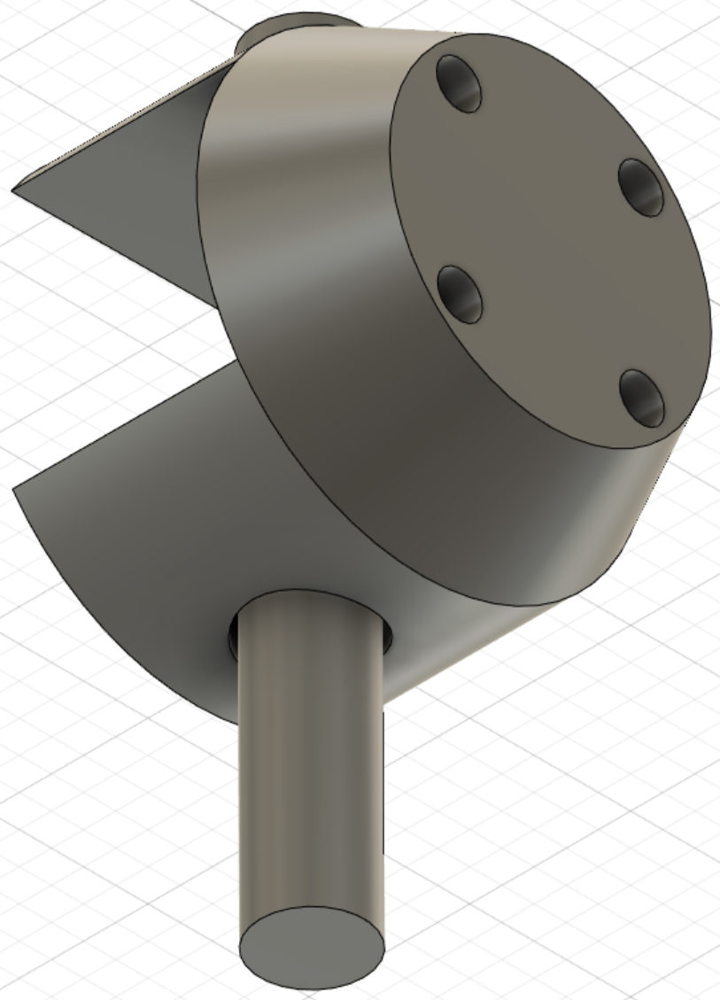
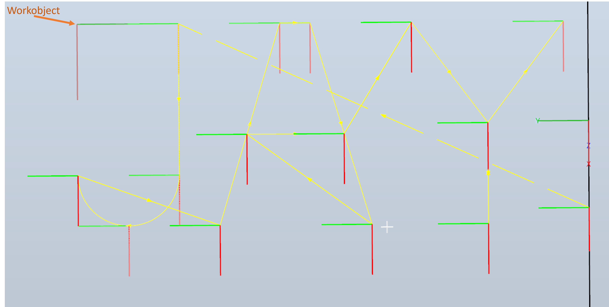
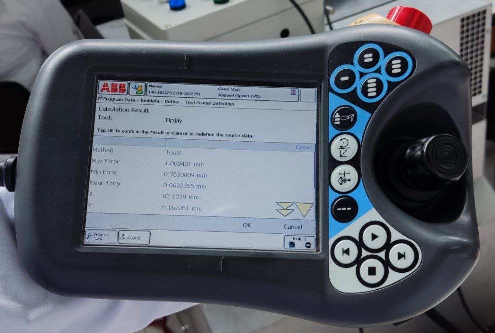
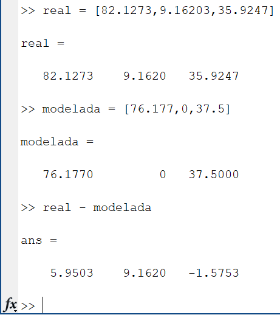

# Laboratorio 4 - Robótica Industrial 

## Diseño de herramienta

El diseño de la herramienta partió inspirandonos en un [diseño en thingiverse](https://www.thingiverse.com/thing:5137683/files) de una herramienta para el robot IRB 120. Este diseño fue modificado para que fuera más facilmente imprimible en 3D, resultando en el siguiente modelo 3D:

Inicialmente se pensó en utilizar un resorte en la zona central de la herramienta pero no fue posible encontrar un resorte adecuado. Por lo tanto, se utilizó simplemente una banda elastica como tope para evitar que el marcador cayera por gravedad, no se utilizo nada para evitar que se saliera por arriba.

Tampoco se utilizo nada que presionara el marcador contra la superficie, se asumio que la gravedad sería suficiente.

## Simulación en Robot Studio

En Robot Studio se creo un workobject y los target relativos a el:

En el siguiente video se puede observar la simulación realizada en Robot Studio:

## Calibración de la herramienta
Para la calibración de la herramienta en fisico se llevo acabo un proceso de 4 punto y de definición del eje Z. Esto teniendo en cuenta la forma de la herramienta, que tiene un movimiento en el eje de aproach del robot y una rotación en el mismo, si este tuviera un offset con respecto al eje de aproach es necesario definirlo junto con su eje x. Ahora bien, en este caso se definio un punto al cual se llego con 4 distintas poses y una con un acercamiento directo en el eje z que deseamos definir , en base a esto ABB genera la definición de la herramienta sobre la cual ya podemos hacer una comparación con la modelada

## Comparación de herramienta modelada y herramienta real
En posición podemos observar que la diferencia no es demasiado grande, sin embargo si hya una diferencia maxima de 10mm lo cual para aplicacioines especificas puede sr bastante importante, recordemos que el error de esta calibracion es de 1mm. Si objenemos la magnitud del vector de diferencia entre los dos da 11 mm y teniendo en cuenta el error puede ser una diferencia de (11+- 1) mm Que no es ideal para muchos caso aplicados.

Por el lado de la rotación podemos observar que los valores en angulos de euler son similares en dos casos, pero en uno de ellos existe una diferencia de pi/4 , esto se pudo haber debido a un montaje que se realizo sin haber hecho un retorno a home posterior por lo que se genero esta fuente de error y de offset.

## Resultados

A continuación se presenta la ejecución del respectivo código de RAPID con los datos de la herramienta obtenidos en la simulación de Robot Studio.

## Conclusiones

- Las simulaciones ayudan significativamente a desarrollar proyectos en la vida real, gracias a la buena aproximación que representan. Pero en muchos casos esta se puede quedar corta debido a lo difícil que es representar de manera exacta un entorno físico en un entorno final. Es por ello que en la gran mayoría de casos se requieren calibraciones para ajustar los valores de las simulaciones, justo como se hizo con la herramienta.

- Definir trayectorias en base a Workobjects resulta especialmente útiles, ya que ante cualquier cambio del entorno, se pueden transformar las trayectorias con gran facilidad

- Es importante respetar las normas de seguridad en entornos con tantos peligros potenciales, ya que un movimiento en falso puede representar perdidas humanas y económicas