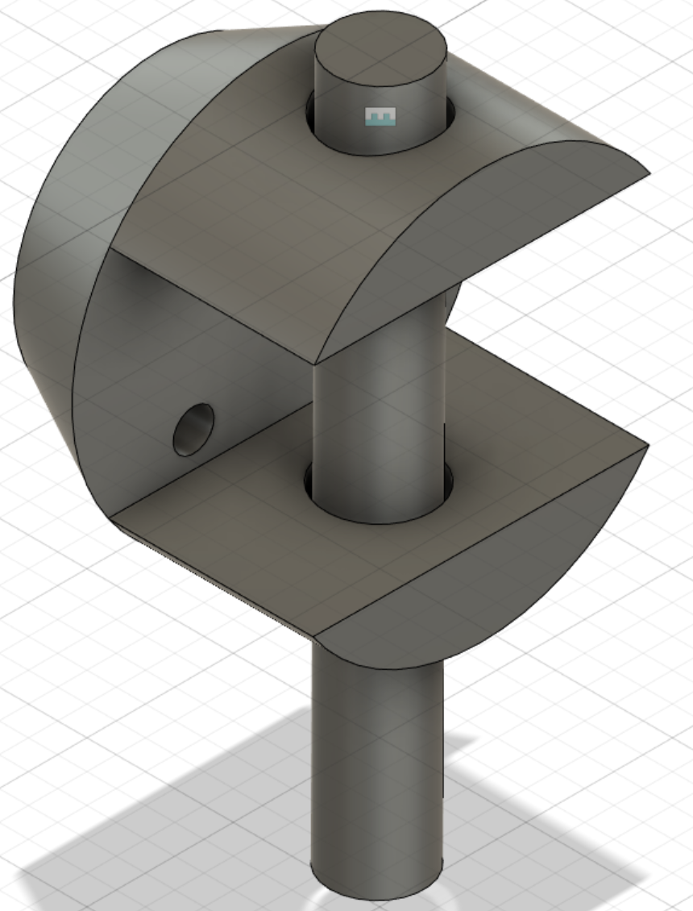
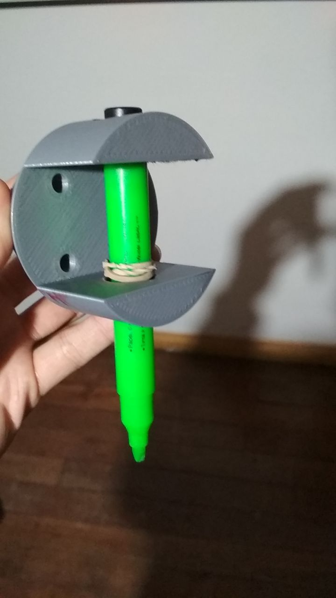

# Laboratorio 4 - Robótica Industrial 

## Diseño de herramienta

El diseño de la herramienta partió inspirandonos en un [diseño en thingiverse](https://www.thingiverse.com/thing:5137683/files) de una herramienta para el robot IRB 120. Este diseño fue modificado para que fuera más facilmente imprimible en 3D, resultando en el siguiente modelo 3D:

Inicialmente se pensó en utilizar un resorte en la zona central de la herramienta pero no fue posible encontrar un resorte adecuado. Por lo tanto, se utilizó simplemente una banda elastica como tope para evitar que el marcador cayera por gravedad, no se utilizo nada para evitar que se saliera por arriba.

Tampoco se utilizo nada que presionara el marcador contra la superficie, se asumio que la gravedad sería suficiente.

# Resultados

A continuación se presenta la ejecución del respectivo código de RAPID con los datos de la herramienta obtenidos en la simulación de Robot Studio.

